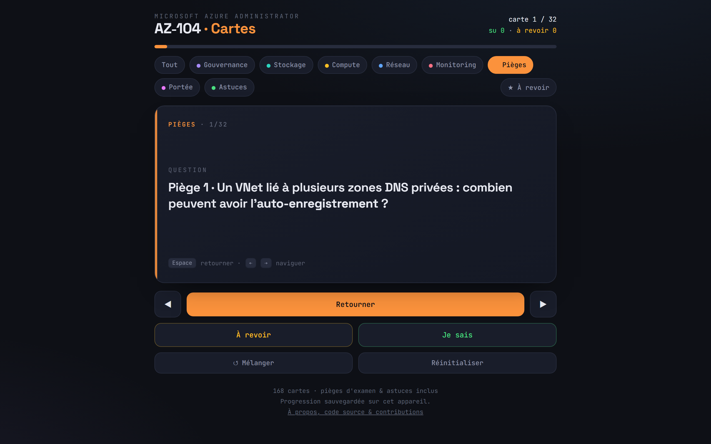

# AZ-104 · Cartes de révision

> 🇬🇧 *Free French-language flashcards app for the Microsoft AZ-104 (Azure Administrator) certification — 168 cards, 33 real exam traps, installable PWA, works offline.*

**168 flashcards en français pour préparer la certification [Microsoft AZ-104](https://learn.microsoft.com/fr-fr/credentials/certifications/azure-administrator/) (Azure Administrator)** — dont 33 pièges d'examen tirés d'erreurs réelles sur des tests blancs. Gratuit, open source, sans inscription, sans tracking.

[](https://anisanis-b.github.io/az104-flashcards/revision.html)
[](https://anisanis-b.github.io/az104-flashcards/)




## Pourquoi ces cartes ?

Les questions de l'AZ-104 ne testent pas ta capacité à réciter la doc : elles ciblent **les détails contre-intuitifs**. Le subnet qui doit s'appeler exactement `AzureBastionSubnet`. L'auto-enregistrement DNS limité à **une seule** zone privée par VNet. Les app settings qui **suivent le code** lors d'un swap de slots. Le peering qui n'est **jamais** transitif.

Chaque carte « Piège » de ce paquet vient d'une erreur réellement commise en préparation. Réviser ces cartes, c'est faire les erreurs **avant** l'examen plutôt que pendant.

## Fonctionnalités

- 🃏 **Rappel actif** — une question au recto, la réponse au verso : tu réponds avant de retourner.
- 🗂️ **8 domaines filtrables** — Gouvernance, Stockage, Compute, Réseau, Monitoring, Pièges d'examen, Portée (global vs régional), Astuces réflexes.
- ⭐ **« Je sais » / « À revoir »** — progression sauvegardée sur l'appareil (localStorage), avec un mode qui ne fait tourner que tes lacunes.
- 📱 **PWA installable** — « Ajouter à l'écran d'accueil » sur Android/iOS : plein écran, icône dédiée, **fonctionne hors ligne**.
- 🔀 **Mélange, navigation au swipe** (mobile) **et au clavier** (desktop).
- 🪶 **Un seul fichier HTML par page, zéro dépendance, zéro compte, zéro tracking.**

## Contenu

| Domaine | Cartes | Ce que ça couvre |
|---|---:|---|
| Identités & Gouvernance | 32 | Entra ID, RBAC, Policy, locks, tags, licences P1/P2 |
| Stockage | 21 | SAS, redondances, tiers, Files/File Sync, object replication |
| Compute | 26 | VM, availability sets/zones, disques, ARM/Bicep, conteneurs, App Service |
| Réseau | 25 | VNet, peering, NSG/ASG, UDR, LB, App Gateway, Bastion, DNS |
| Monitoring & Maintenance | 16 | Azure Monitor, alertes, Log Analytics, Backup, ASR |
| **Pièges d'examen** | 32 | Les limites et exclusivités que les questions pièges adorent |
| Global vs Régional | 3 | Quels services sont globaux, régionaux, ou entre les deux |
| Astuces réflexes | 13 | Mot-clé de l'énoncé → réponse attendue |

> ℹ️ Les pièges gardent leur numérotation d'origine (1 → 33, sans n°12) : si tu retrouves ces numéros dans tes propres notes, ils correspondent.

## Utilisation

- **En ligne** : [anisanis-b.github.io/az104-flashcards/revision.html](https://anisanis-b.github.io/az104-flashcards/revision.html)
- **Sur téléphone** : ouvre le lien ci-dessus → menu du navigateur → **« Ajouter à l'écran d'accueil »**. L'app fonctionne ensuite même sans connexion.
- **Hors ligne / local** : télécharge `revision.html` et ouvre-le dans n'importe quel navigateur — tout est autonome.

### Raccourcis clavier

| Touche | Action |
|---|---|
| `Espace` | Retourner la carte |
| `←` / `→` | Carte précédente / suivante |
| `J` | Marquer « je sais » |
| `R` | Marquer « à revoir » |
| `S` | Mélanger |

## Contribuer

Une carte fausse ? Un piège qui t'a eu à l'examen blanc et qui manque ici ? **Les issues et pull requests sont bienvenues.**

Ajouter une carte = ajouter une ligne dans le tableau `CARDS` de [`revision.html`](revision.html) :

```js
{d:"pie",  // domaine : gov · sto · com · net · mon · pie · geo · tip
 q:"Piège 34 · La question, côté recto ?",
 a:"La réponse, côté verso."},
```

Merci de sourcer les faits vérifiables (doc Microsoft Learn) dans la description de la PR.

## Stack

HTML + CSS + JavaScript vanilla, un fichier par page. Pas de framework, pas de build, pas de dépendance. La progression vit dans `localStorage` (clé `az104-progress-v1`), le mode hors ligne dans un petit service worker ([`sw.js`](sw.js)).

## Licence & marques

Code et contenu sous licence [MIT](LICENSE). Projet indépendant, **non affilié à Microsoft** — AZ-104, Azure et Microsoft sont des marques de Microsoft Corporation. Les informations reflètent l'état des services Azure au moment de la rédaction (2026) : vérifie toujours la [doc officielle](https://learn.microsoft.com/fr-fr/azure/) en cas de doute.

---

*Fait par [@AnisAnis-b](https://github.com/AnisAnis-b) pendant sa propre préparation de l'AZ-104. Si ces cartes t'aident, une ⭐ fait toujours plaisir.*
